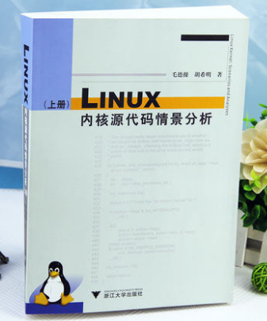
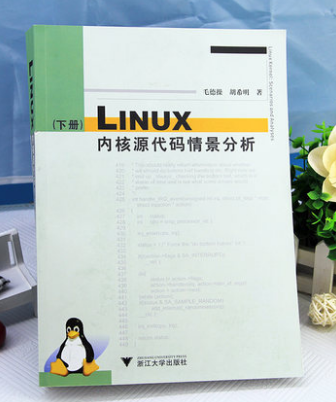

# linux-2.4.0 内核学习笔记

本仓库已经开始作为GitBook仓库，访问地址

<https://yifengyou.gitbooks.io/linux-2-4-0/content/>

GitHub访问地址

<https://github.com/yifengyou/linux-2.4.0/>

```
Something I hope you know before go into the coding~
First, please watch or star this repo, I'll be more happy if you follow me.
Bug report, questions and discussion are welcome, you can post an issue or pull a request.
```

## 参考书目





## 内容简介

《LINUX内核源代码情景分析》写法独特，论述精辟，不回避代码分析中的难点，可以作为操作系统高级课程的教材，也可以作为计算机软件专业和相关专业大学本科高年级学生和研究生深入学习操作系统以至软件核心技术的重要参考书。同时，还可作为各行业从事软件开发的工程师、研究人员以及其他对Linux最新技术感兴趣者的自学教材。

```PS:不是我说的~```

## 《Linux内核情景分析》目录

* [第一章-预备知识](docs/第一章-预备知识/第一章-预备知识.md)
* [第二章-存储管理](docs/第二章-存储管理/第二章-存储管理.md)
* [第三章-中断异常和系统调用](docs/第三章-中断异常和系统调用/第三章-中断异常和系统调用.md)
* [第四章-进程和进程调度](docs/第四章-进程和进程调度/第四章-进程和进程调度.md)
* [第五章-文件系统](docs/第五章-文件系统/第五章-文件系统.md)
* [第六章-传统Unix进程通信](docs/第六章-传统Unix进程通信/第六章-传统Unix进程通信.md)
* [第七章-基于socket的进程通信](docs/第七章-基于socket的进程通信/第七章-基于socket的进程通信.md)
* [第八章-设备驱动](docs/第八章-设备驱动/第八章-设备驱动.md)
* [第九章-多处理器的SMP系统结构](docs/第九章-多处理器的SMP系统结构/第九章-多处理器的SMP系统结构.md)
* [第十章-系统的引导和初始化](docs/第十章-系统的引导和初始化/第十章-系统的引导和初始化.md)
* [勘误](docs/勘误.md)


## 个人的一些看法

## 总结

```
  1.基础永远值得花费90%的精力去学习加强。厚积而薄发~
  2.要理解一个软件系统的真正运行机制，一定要阅读其源代码~
```
